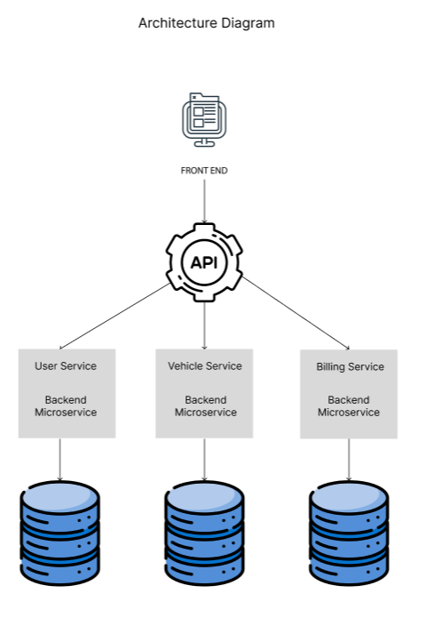

# Assignment-1---Car-Sharing-Platform

# Jayden Toh Xuan Ming, S10241868J

Creating a Car Sharing Platform in Go

---

## Design Considerations

### Scalability

- Each microservice can be scaled independently.
- Stateless services facilitate horizontal scaling.

### Maintainability

- Separate microservices handle distinct business logic: billing, users, vehicles, and frontend.

### Security

- **HTTPS** used for external communication.
- **API Gateway** or load balancer routes requests securely.
- Sensitive data (payment details, passwords) is encrypted at rest and in transit.

### Fault Tolerance & Resilience

- Microservices are isolated, preventing system-wide failure.

### Technology Stack

- **Backend**: Go (Golang) for microservices
- **Frontend**: React + Vite
- **Database**: MySQL

---

## Architecture Diagram



- **Billing Service**: Calculates costs, applies discounts, generates invoices.
- **User Service**: Manages user registration, authentication, and membership tiers.
- **Vehicles Service**: Tracks vehicle status (available/booked). Book vehicle, modify booking and cancel reservation
- **MySQL Database**: Stores structured data for each microservice.

---

## Database Design

- **`users`**: Holds user info, including name, email, membership tier, etc.
- **`vehicles`**: Stores vehicle data (model, status).
- **`reservations`**: Associates users with vehicles, start/end times, cost details.
- **`billing`**: Contains membership tiers, hourly rates, discount percentages.
- **`promotions`**: Discount percentages.

---

# Setup and Instructions

---

````md
# Setup and Instructions

## Database Setup

### 1. Database Script

A file named **`script.sql`** is provided. This script creates the necessary tables and initial data.

```sql
-- Drop existing tables if they exist
DROP TABLE IF EXISTS my_db.invoices;
DROP TABLE IF EXISTS my_db.billing;
DROP TABLE IF EXISTS my_db.reservations;
DROP TABLE IF EXISTS my_db.vehicles;
DROP TABLE IF EXISTS my_db.users;

-- Create Users Table
CREATE TABLE my_db.users (
    ID VARCHAR(5) NOT NULL PRIMARY KEY,
    FirstName VARCHAR(30),
    LastName VARCHAR(30),
    Email VARCHAR(50) UNIQUE,
    Password VARCHAR(255),
    MembershipTier ENUM('Basic', 'Premium', 'VIP') DEFAULT 'Basic'
);

-- Data for Users
INSERT INTO my_db.users (ID, FirstName, LastName, Email, Password, MembershipTier)
VALUES
    ('01', 'John', 'Tan', 'john@gmail.com', 'drivingcar', 'Basic'),
    ('02', 'Alice', 'Wonder', 'alice@gmail.com', 'flyingman', 'Premium'),
    ('03', 'Bob', 'Morse', 'bob@gmail.com', 'ridingacar', 'Premium'),
    ('04', 'Jane', 'Doe', 'jane@gmail.com', 'drivingwoman', 'VIP'),
    ('05', 'Jayden', 'Toh', 'jayden@gmail.com', 'jaypassword', 'VIP');

-- Create Vehicles Table
CREATE TABLE my_db.vehicles (
    ID VARCHAR(5) NOT NULL PRIMARY KEY,
    Model VARCHAR(50),
    Status ENUM('available', 'booked') DEFAULT 'available'
);

-- Data for Vehicles
INSERT INTO my_db.vehicles (ID, Model, Status)
VALUES
    ('01', 'Tesla', 'available'),
    ('02', 'Nissan', 'booked'),
    ('03', 'Toyota', 'available'),
    ('04', 'BMW', 'booked'),
    ('05', 'Tesla Model S', 'available');

-- Create Reservations Table
CREATE TABLE my_db.reservations (
    ID VARCHAR(36) NOT NULL PRIMARY KEY,
    UserID VARCHAR(5) NOT NULL,
    VehicleID VARCHAR(5) NOT NULL,
    StartTime DATETIME NOT NULL,
    EndTime DATETIME NOT NULL,
    Hours DECIMAL(5, 2) NOT NULL,
    Cost DECIMAL(10, 2) NOT NULL,
    Discount DECIMAL(10, 2) NOT NULL,
    Total DECIMAL(10, 2) NOT NULL,
    FOREIGN KEY (UserID) REFERENCES my_db.users(ID) ON DELETE CASCADE,
    FOREIGN KEY (VehicleID) REFERENCES my_db.vehicles(ID) ON DELETE CASCADE
);

-- Create Billing Table
CREATE TABLE my_db.billing (
    ID INT AUTO_INCREMENT PRIMARY KEY,
    MembershipTier ENUM('Basic', 'Premium', 'VIP') NOT NULL,
    HourlyRate DECIMAL(10, 2) NOT NULL,
    DiscountPercentage DECIMAL(5, 2) NOT NULL
);

-- Data for Billing
INSERT INTO my_db.billing (MembershipTier, HourlyRate, DiscountPercentage)
VALUES
    ('Basic', 10.00, 0.00),
    ('Premium', 15.00, 10.00),
    ('VIP', 20.00, 20.00);

-- Create Promotions Table
CREATE TABLE my_db.promotions (
    id INT PRIMARY KEY AUTO_INCREMENT,
    min_amount DECIMAL(10, 2) NOT NULL,
    discount_percentage DECIMAL(5, 2) NOT NULL
);

-- Data for Promotions
INSERT INTO my_db.promotions (min_amount, discount_percentage) VALUES (200, 30.00);
INSERT INTO my_db.promotions (min_amount, discount_percentage) VALUES (100, 20.00);
INSERT INTO my_db.promotions (min_amount, discount_percentage) VALUES (50, 10.00);
```
````

---

# Project Setup and Usage

## 2. Executing the Script

1. **Launch MySQL** via MySQL Workbench (or your preferred method).
2. **Create the database**:
   ```sql
   CREATE DATABASE my_db;
   USE my_db;
   ```
3. **Run** the script above. It will create:
   - `users`
   - `vehicles`
   - `reservations`
   - `billing`
   - `promotions`

---

## Running the Microservices

### Frontend

1. **Open a new terminal**:
   ```bash
   cd frontend
   ```
2. **Install dependencies** and **run** the development server:
   ```bash
   npm install
   npm run dev
   ```
3. The frontend is now accessible at [http://localhost:5173](http://localhost:5173).

---

### User Service

1. **Open another terminal**:
   ```bash
   cd user-service
   go run main.go
   ```
   - Typically runs on **port `8002`** (adjust if needed).

---

### Vehicle Service

1. **Open another terminal**:
   ```bash
   cd vehicle-service
   go run main.go
   ```
   - Typically runs on **port `8003`** (adjust if needed).

---

### Billing Service

1. **Open another terminal**:
   ```bash
   cd billing-service
   go run main.go
   ```
   - Typically runs on **port `8001`** (adjust if needed).

> **Note**: Adjust ports according to your `.env` or code settings.

---

# Postman Testing

Once all services are running, use **Postman** (or similar tool) to test each endpoint.

## 1. **User Service** (Example)

Base URL: `http://localhost:8002`

---

### 1.1. Register User

- **Method:** `POST`
- **Endpoint:** `/register`
- **Description:** Create a new user.

**Headers:**

```http
Content-Type: application/json
```

**Body (JSON):**

```json
{
  "id": "07",
  "firstName": "Jane",
  "lastName": "Doe",
  "email": "jane@example.com",
  "password": "secret123",
  "membershipTier": "Basic"
}
```

**Expected Response** (`200 OK`):

```json
{
  "message": "User registered successfully!"
}
```

---

### 1.2. Update Profile

- **Method:** `PUT`
- **Endpoint:** `/update-profile`
- **Description:** Update an existing user’s details.

**Headers:**

```http
Content-Type: application/json
```

**Body (JSON):**

```json
{
  "id": "07",
  "first_name": "Janet",
  "last_name": "Smith",
  "email": "janet@example.com",
  "password": "newpass123"
}
```

**Expected Response** (`200 OK`):

```json
{
  "message": "Profile updated successfully!"
}
```

> Adjust the keys if your backend expects `firstName` instead of `first_name`.

---

### 1.3. User Login (Optional Example)

- **Method:** `POST`
- **Endpoint:** `/login`
- **Description:** Authenticate user.

**Headers:**

```http
Content-Type: application/json
```

**Body (JSON):**

```json
{
  "email": "janet@example.com",
  "password": "newpass123"
}
```

**Expected Response** (`200 OK`):

```json
{
  "message": "Login successful!",
  "token": "JWT or session token here"
}
```

---

## 2. **Vehicle Service** (Example)

Base URL: `http://localhost:8003`

---

### 2.1. Get All Vehicles

- **Method:** `GET`
- **Endpoint:** `/vehicles`
- **Description:** Retrieves a list of all vehicles.

**Expected Response** (`200 OK`):

```json
[
  {
    "ID": "01",
    "Model": "Tesla",
    "Status": "available"
  },
  ...
]
```

---

### 2.2. Update Vehicle Status

- **Method:** `POST`
- **Endpoint:** `/update-status`
- **Description:** Change a vehicle’s status (e.g., to `booked`).

**Headers:**

```http
Content-Type: application/json
```

**Body (JSON):**

```json
{
  "vehicle_id": "03",
  "status": "booked"
}
```

**Expected Response** (`200 OK`):

```json
{
  "message": "Vehicle status updated successfully!"
}
```

---

## 3. **Billing Service**

Base URL: `http://localhost:8001`

---

### 3.1. Calculate Billing

- **Method:** `POST`
- **Endpoint:** `/calculate-billing`
- **Description:** Calculate the cost of a rental (saved in DB).

**Headers:**

```http
Content-Type: application/json
```

**Body (JSON):**

```json
{
  "membership_tier": "Premium",
  "start_time": "2025-03-01 10:00:00",
  "end_time": "2025-03-01 12:00:00"
}
```

**Expected Response** (`200 OK`):

```json
{
  "membership_tier": "Premium",
  "start_time": "2025-03-01 10:00:00",
  "end_time": "2025-03-01 12:00:00",
  "hours": 2,
  "cost": 30.0,
  "discount": 3.0,
  "total": 27.0
}
```

---

### 3.2. Estimate Billing

- **Method:** `POST`
- **Endpoint:** `/estimate-billing`
- **Description:** Estimate cost without finalizing or saving.

**Headers:**

```http
Content-Type: application/json
```

**Body (JSON):**

```json
{
  "membership_tier": "Basic",
  "start_time": "2025-05-10 14:00:00",
  "end_time": "2025-05-10 16:00:00"
}
```

**Expected Response** (`200 OK`):

```json
{
  "membership_tier": "Basic",
  "start_time": "2025-05-10 14:00:00",
  "end_time": "2025-05-10 16:00:00",
  "hours": 2,
  "cost": 20.0,
  "discount": 0.0,
  "total": 20.0
}
```

---

### 3.3. Generate Invoice

- **Method:** `POST`
- **Endpoint:** `/generate-invoice`
- **Description:** Send an invoice email to the user.

**Headers:**

```http
Content-Type: application/json
```

**Body (JSON):**

```json
{
  "user_email": "john@gmail.com",
  "user_id": "01",
  "reservation_id": 1,
  "total_amount": 27.0
}
```

**Expected Response** (`200 OK`):

```json
{
  "message": "Invoice sent successfully!"
}
```

---
